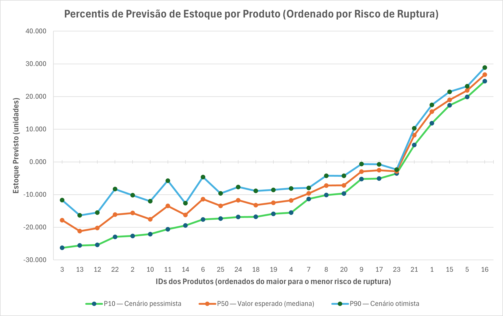

# 📊 Previsão Inteligente de Estoque com Amazon SageMaker Canvas
### 👤 Autor

### Fabio Toledo Bonemer De Salvi

Projeto desenvolvido no contexto do desafio da DIO utilizando o **Amazon SageMaker Canvas**, com foco em **Machine Learning no-code aplicado à previsão de estoque**, incluindo análise crítica dos dados e interpretação dos resultados

<!--
Projeto desenvolvido como parte do desafio *“Previsão de Estoque Inteligente na AWS com SageMaker Canvas”*, com foco não apenas na execução do modelo no-code, mas também na **análise crítica dos dados, interpretação dos resultados e aplicação de regras de negócio** para cenários reais de gestão de estoque.
-->

---

## 📌 Contexto do Projeto

Este projeto tem como objetivo demonstrar o uso do **Amazon SageMaker Canvas** para criar um modelo de **previsão de estoque baseada em séries temporais**, partindo de um dataset simples e evoluindo até a geração de previsões com **intervalos de incerteza**.

Além da execução do fluxo proposto no curso, foram realizadas análises adicionais para garantir que os resultados fossem **interpretáveis e aplicáveis a um cenário real de negócio**.

<!--
## 📌 Visão Geral do Projeto

Este projeto demonstra como utilizar o **Amazon SageMaker Canvas** para criar um modelo de **previsão de estoque baseada em Machine Learning**, partindo de dados históricos simples e evoluindo até uma análise interpretável e aplicável ao contexto de negócio.

O diferencial deste trabalho está em:

- Análise exploratória dos dados de entrada

- Interpretação correta das previsões probabilísticas (P10, P50, P90)

- Tratamento e explicação de **previsões negativas**

- Comunicação visual dos resultados com **tabelas e gráficos**
-->
---

## 🎯 Objetivo do Desafio

- Utilizar o **SageMaker Canvas** para treinar um modelo de previsão

- Prever a **quantidade de unidades em estoque para o próximo dia**

- Analisar e interpretar corretamente os resultados gerados pelo modelo

- Documentar o processo de forma clara e estruturada

<!--
## 🎯 Objetivo

Prever a **quantidade de unidades em estoque para o próximo dia**, por produto, utilizando um modelo de séries temporais treinado no SageMaker Canvas, considerando também a **incerteza associada às previsões**.
-->
---

## 📋 Dataset Utilizado

O dataset contém dados históricos de estoque por produto, com a seguinte estrutura:

<!--
O dataset de treino possui a seguinte estrutura:
-->

| Campo | Descrição |
| --- | --- |
| ID_PRODUTO | Identificador único do produto |
| DIA |	Data do registro |
| FLAG_PROMOCAO | Indica se  produto estava em promoção. (0 = não, 1 = sim) |
| QUANTIDADE_ESTOQUE | Quantidade disponível em estque |

Exemplo utilizando os primeiros registros do *dataset*:

| ID_PRODUTO | DIA	| FLAG_PROMOCAO	| QUANTIDADE_ESTOQUE |
| :---: | :---: | :---: | :---: |
| 1 | 2023-12-31 | 0 | 91 |
| 2 | 2023-12-31 | 0 | 64 |
| 3 | 2023-12-31 | 0 | 66 |

📌 **Observação importante**

O modelo foi treinado para prever o **nível absoluto de estoque**, o que exige cuidados adicionais na interpretação das saídas.

---

## 🚀 Metodologia

1️⃣ Seleção e Upload do Dataset

O dataset foi carregado no SageMaker Canvas sem necessidade de código, utilizando a interface visual da ferramenta.

2️⃣ Treinamento do Modelo

- Tipo de problema: **Previsão temporal**

- Variável alvo: `QUANTIDADE_ESTOQUE`

- Horizonte de previsão: **1 dia**

- Saídas geradas:

    - P10 (cenário pessimista)

    - P50 (mediana – previsão central)

    - P90 (cenário otimista)

    - Mean (média)

---

## 🚀 Utilização do Amazon SageMaker Canvas (Passo a Passo)

Esta seção descreve **todo o fluxo realizado no ambiente SageMaker Canvas**, desde a importação dos dados até a geração de previsões em lote (*batch predictions*), utilizando **séries temporais**.

---

### 1️⃣ Acesso ao SageMaker Canvas

**1.** Acesse o **AWS Management Console**

**2.** Navegue até **Amazon SageMaker AI**

**3.** Selecione **SageMaker Canvas**

**4.** Clique em **Launch SageMaker Canvas**

📷 Figura 1 – Tela inicial do SageMaker Canvas
[Inserir captura de tela aqui]

---

### 2️⃣ Importação do Dataset

**1.** No menu lateral, selecione **Datasets**

**2.** Clique em **Create dataset**

**3.** Escolha a origem dos dados:

- Upload local (CSV)

- Amazon S3

**4.** Faça o upload do arquivo contendo os dados históricos de estoque

Garanta que o seu arquivo esteja codificado em **UTF-8**.

Estrutura do dataset utilizado:

`ID_PRODUTO | DIA | FLAG_PROMOCAO | QUANTIDADE_ESTOQUE`

📌 O campo `DIA` foi utilizado como **coluna temporal** no formato `yyyy-mm-dd`, sendo uma **timestamp**
📌 O campo `QUANTIDADE_ESTOQUE` foi definido como **variável alvo**

📷 Figura 2 – Upload e visualização do dataset no Canvas
[Inserir captura de tela aqui]

---

### 3️⃣ Criação do Modelo de Previsão

**1.** Com o dataset carregado, clique em **Create model**

**2.** Escolha o tipo de problema:

- **Time series forecasting** (previsão de séries temporais)

**3.** Configure os parâmetros principais:

- **Target column:** `QUANTIDADE_ESTOQUE`

- **Time column:** `DIA`

- **Item identifier:** `ID_PRODUTO`

**4.** Defina o horizonte de previsão:

- **1 dia à frente**

📷 Figura 3 – Configuração do modelo de série temporal
[Inserir captura de tela aqui]

---

### 4️⃣ Treinamento do Modelo

**1.** Selecione o tipo de build:

- **Standard build** (recomendado)

**2.** Inicie o treinamento do modelo

**3.** Aguarde a finalização do processo

Durante essa etapa, o Canvas:

- Seleciona automaticamente o algoritmo

- Realiza engenharia de atributos

- Treina múltiplos modelos internamente

📷 Figura 4 – Processo de treinamento em execução
[Inserir captura de tela aqui]

---

### 5️⃣ Análise do Modelo

Após o treinamento:

**1.** Acesse a aba **Model analysis**

**2.** Analise:

- Métricas de desempenho

- Importância das variáveis

- Comportamento da série temporal

**3.** Verifique se o modelo captura tendência e variação dos dados

📷 Figura 5 – Análise e métricas do modelo
[Inserir captura de tela aqui]

---

### 6️⃣ Geração de Previsões (Single Prediction)

**1.** Acesse a aba **Predict**

**2.** Selecione **Single prediction**

**3.** Informe a data futura para previsão

**4.** Visualize os valores previstos:

- **P10** (cenário pessimista)

- **P50** valor mediano (mais provável)

- **P90** (cenário otimista)

- **Mean**

📷 Figura 6 – Previsão individual no Canvas
[Inserir captura de tela aqui]

---

### 7️⃣ Geração de Previsões em Lote (Batch Prediction)

**1.** Ainda na aba **Predict**, selecione **Batch prediction**

**2.** Escolha o dataset base para previsão

**3.** Defina o horizonte temporal

**4.** Execute a previsão em lote

O SageMaker Canvas gera automaticamente:

- Um arquivo **CSV**- 

- Armazenado no **Amazon S3**
<!--
- Contendo previsões para todos os produtos
-->
- As previsões para todos os produtos

📷 Figura 7 – Configuração da batch prediction
[Inserir captura de tela aqui]

---

### 8️⃣ Exportação e Análise dos Resultados

**1.** Faça o download do arquivo CSV gerado

**2.** Analise os resultados externamente (Excel ou similar)

**3.** Interprete corretamente:

- Intervalo de incerteza (P10–P90)

- Valores negativos como **indicador de risco de ruptura**

**4.** Aplique regras de negócio quando necessário

📷 Figura 8 – Arquivo de previsão exportado (CSV)
[Inserir captura de tela aqui]

---

### 🧠 Observações Importantes sobre o SageMaker Canvas

- O Canvas **não impõe restrições físicas** (ex: estoque ≥ 0)

- Previsões negativas devem ser tratadas como:

    - Alto risco de ruptura

    - Tendência de queda acentuada

- A aplicação de **regras de negócio no pós-processamento** é uma prática recomendada

--- 

### ✅ Contribuição Técnica Neste Projeto

Além da utilização do SageMaker Canvas conforme proposto no curso, este projeto incluiu:

- Análise crítica do dataset

- Interpretação correta de previsões probabilísticas

- Tratamento conceitual de valores negativos

- Visualização dos resultados com foco em negócio

---

## 📊 Resultados Obtidos<!--da Previsão-->

### Tabela de Previsões

O *dataset* utilizado para treinar o modelo de predição de estoque contempla os dados do número de itens de estoque de 25 produtos durente 20 dias consecutivos, iniciando no dia x e terminand no dia x.

O SageMaker Canvas gerou previsões probabilísticas para cada produto, incluindo:

- **P10** – cenário pessimista

- **P50** – mediana (valor mais provável)

- **P90** – cenário otimista

- **Mean** – média das previsões

A previsão de estoque obtida pelo modelo de predição é referente a **1 dia**, ou seja, ao dia **20/01/2024**, próximo dia na série temporal, e é apresentada na tabela abaixo:

| ID do Produto | P10 | P50 | P90 | Média |
| :---: | :---: | ---: | ---: | ---: |
| 1 | 2024-01-20 | 11.870 | 15.396 | 17.470 | 14.905 |  |  |  |  |  |  |  |  | 
| 2 | 2024-01-20 | -22.645 | -15.637 | -10.207 | -16.021 |  |  |  |  |  |  |  |  | 
| 3 | 2024-01-20 | -26.289 | -17.811 | -11.696 | -18.653 |  |  |  |  |  |  |  |  | 
| 4 | 2024-01-20 | -15.521 | -11.788 | -8.119 | -11.978 |  |  |  |  |  |  |  |  | 
| 5 | 2024-01-20 | 19.872 | 21.875 | 23.157 | 21.716 |  |  |  |  |  |  |  |  | 
| 6 | 2024-01-20 | -17.603 | -11.391 | -4.632 | -11.475 |  |  |  |  |  |  |  |  | 
| 7 | 2024-01-20 | -11.331 | -9.628 | -7.959 | -9.595 |  |  |  |  |  |  |  |  | 
| 8 | 2024-01-20 | -10.143 | -7.222 | -4.218 | -7.063 |  |  |  |  |  |  |  |  | 
| 9 | 2024-01-20 | -5.230 | -2.964 | -0.656 | -2.960 |  |  |  |  |  |  |  |  | 
| 10 | 2024-01-20 | -22.092 | -17.558 | -12.021 | -17.328 |  |  |  |  |  |  |  |  | 
| 11 | 2024-01-20 | -20.606 | -13.481 | -5.727 | -13.430 |  |  |  |  |  |  |  |  | 
| 12 | 2024-01-20 | -25.398 | -20.235 | -15.500 | -20.331 |  |  |  |  |  |  |  |  | 
| 13 | 2024-01-20 | -25.557 | -21.183 | -16.350 | -21.201 |  |  |  |  |  |  |  |  | 
| 14 | 2024-01-20 | -19.472 | -16.209 | -12.630 | -16.214 |  |  |  |  |  |  |  |  | 
| 15 | 2024-01-20 | 17.321 | 18.991 | 21.452 | 19.181 |  |  |  |  |  |  |  |  | 
| 16 | 2024-01-20 | 24.706 | 26.695 | 28.861 | 26.761 |  |  |  |  |  |  |  |  | 
| 17 | 2024-01-20 | -5.087 | -2.536 | -0.722 | -2.813 |  |  |  |  |  |  |  |  | 
| 18 | 2024-01-20 | -16.792 | -13.222 | -8.862 | -13.109 |  |  |  |  |  |  |  |  | 
| 19 | 2024-01-20 | -15.893 | -12.506 | -8.569 | -12.306 |  |  |  |  |  |  |  |  | 
| 20 | 2024-01-20 | -9.655 | -7.185 | -4.257 | -7.179 |  |  |  |  |  |  |  |  | 
| 21 | 2024-01-20 | 5.185 | 8.192 | 10.307 | 7.997 |  |  |  |  |  |  |  |  | 
| 22 | 2024-01-20 | -22.914 | -16.121 | -8.317 | -15.460 |  |  |  |  |  |  |  |  | 
| 23 | 2024-01-20 | -3.548 | -2.912 | -2.359 | -2.941 |  |  |  |  |  |  |  |  | 
| 24 | 2024-01-20 | -16.842 | -11.717 | -7.665 | -12.278 |  |  |  |  |  |  |  |  | 
| 25 | 2024-01-20 | -17.309 | -13.440 | -9.650 | -13.411 |  |  |  |  |  |  |  |  | 

📌 O uso de percentis permite avaliar **incerteza e risco**, e não apenas um valor pontual.

<!--
📌 **Interpretação correta**

Valores negativos **não representam estoque físico negativo**, mas sim:

- Forte tendência de queda
- Alto risco de **ruptura total de estoque**
-->

---
## 📊 Análise dos Resultados
<!--
### 🧠 Interpretação dos Resultados
-->

Durante a análise, foram observadas **previsões negativas de estoque** para alguns produtos.

Esses valores **não representam estoque físico negativo**, mas indicam:

- Tendência de queda acentuada

- **Alto risco de ruptura de estoque**

Essa característica é esperada em modelos de previsão que **não impõem restrições físicas**, como é o caso do SageMaker Canvas.

### 🔍 Interpretação dos Percentis

Valores negativos **não representam erro**, mas sim **sinal de risco de ruptura**.

| Percentil | Interpretação |
| :---: | :---: | 
| P10 < 0 | Risco elevado |
| P50 < 0 | Ruptura provável |
| P90 < 0 | Ruptura quase certa |
📷 **Tabela x** - Interpretaçã dos percentis

---

### 🚦 Classificação de Risco

| Condição | Indicador |
| :---: | :---: |
| P10 ≥ 0 | 🟢 Seguro |
| P10 < 0 e P50 ≥ 0 | 🟡 Atenção |
| P50 < 0 | 🔴 Ruptura provável |
📷 **Tabela x** - Classificação de risco

---

## 🛠️ Regra de Negócio Aplicada

Para tornar os resultados aplicáveis ao contexto real, foi adotada a seguinte regra de pós-processamento:

`Estoque_final = MAX(0, Estoque_previsto)`

📌 Valores negativos são interpretados como **estoque zerado**, indicando ruptura total.

Essa abordagem é amplamente utilizada em projetos reais de **Supply Chain e Forecasting** (cadeia de suprimentos e previsões).

---

## 📈 Visualização dos Resultados
<!--### Gráfico Principal-->

### Previsão de Estoque para o Próximo Dia (P10–P90 com Mediana P50)

- Linha central: P50
- Faixa sombreada: Intervalo de incerteza (P10–P90)
- Eixo Y com referência em zero
- Produtos ordenados por risco

#### Gráfico de linhas

<!--Markdown

-->

📷 Figura 1 – (Gráfico de linhas). Ordenação baseada no percentil P10, que representa o cenário pessimista da previsão.

---

### Tabela de Risco de Ruptura

| ID do Produto | P10 (pessimista) | P50 (mediana) | P90 (otimista) | Estoque Previsto (P50 ajustado) | Risco de Ruptura |
| :---: | :---: | :---: | :---: | :---: | :---: |
| 2 | 0 | 0 | 0 | 0 | 🔴 Alto |
| 3 | 0 | 0 | 0 | 0 | 🔴 Alto |
| 5 | 0 | 0 | 0 | 22 | 🟢 Baixo |

📷 Tabela x – Tabela de risco por produto

---

### Linha do tempo do estoque de alguns produtos selecionados

Os gráficos da linha do tempo de todos os produtos estão dispoíveis [<u>no repositório deste projeto</u>]():

- Produto x:

📷 Figura x – Evolução Temporal do Estoque com Intervalo de Previsão do produto x.
(Inserir imagem do gráfico aqui)

- Produto x:

📷 Figura x – Evolução Temporal do Estoque com Intervalo de Previsão do produto x.
(Inserir imagem do gráfico aqui)

---

## 📌 Conclusões

- O SageMaker Canvas permite criar modelos robustos de previsão sem código

- A interpretação correta das saídas probabilísticas é essencial

- Valores negativos são **indicadores de risco**, não erros

- A combinação de ML + regras de negócio torna o modelo aplicável ao mundo real

---

## 🔮 Próximos Passos

- Prever **demanda diária** em vez de estoque absoluto

- Incorporar mais variáveis:
    - sazonalidade
    - vendas
    - lead time (tempo total decorrido entre o início de um processo e a sua conclusão final)

- Automatizar o pipeline com AWS Lambda e S3

- Criar dashboard no QuickSight

---

## 🤔 Dúvidas ou Sugestões?

Sinta-se à vontade para abrir uma issue neste repositório ou entrar em contato.